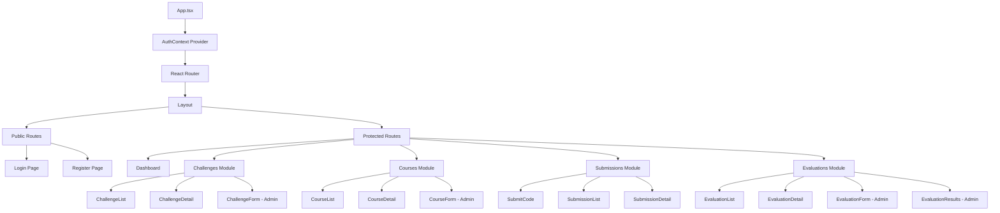
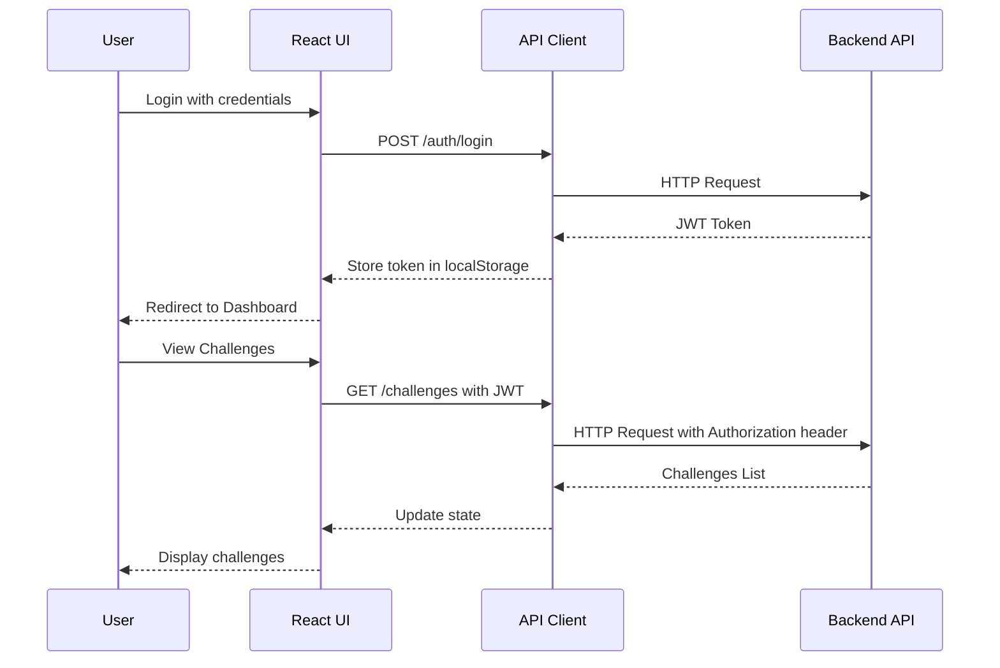

# Frontend Architecture - Online Judge Platform

## Overview

This document outlines the architecture for the frontend application of the Online Judge platform using **React + Vite + TailwindCSS**.

## Tech Stack

| Technology | Purpose |
|------------|---------|
| React 18 | UI Framework |
| Vite | Build tool and dev server |
| TailwindCSS | Utility-first CSS framework |
| React Router v6 | Client-side routing |
| Axios | HTTP client for API calls |
| React Query | Server state management |
| React Context | Auth state management |
| Monaco Editor | Code editor for submissions |
| React Hot Toast | Notifications |

## Project Structure

```
frontend/
├── public/
│   └── favicon.ico
├── src/
│   ├── api/                    # API client configuration
│   │   ├── axios.ts            # Axios instance with interceptors
│   │   ├── auth.api.ts         # Auth endpoints
│   │   ├── challenges.api.ts   # Challenges endpoints
│   │   ├── courses.api.ts      # Courses endpoints
│   │   ├── submissions.api.ts  # Submissions endpoints
│   │   └── evaluations.api.ts  # Evaluations endpoints
│   │
│   ├── components/             # Reusable components
│   │   ├── ui/                 # Basic UI components
│   │   │   ├── Button.tsx
│   │   │   ├── Input.tsx
│   │   │   ├── Card.tsx
│   │   │   ├── Modal.tsx
│   │   │   ├── Badge.tsx
│   │   │   ├── Spinner.tsx
│   │   │   └── Select.tsx
│   │   │
│   │   ├── layout/             # Layout components
│   │   │   ├── Navbar.tsx
│   │   │   ├── Sidebar.tsx
│   │   │   ├── Layout.tsx
│   │   │   └── Footer.tsx
│   │   │
│   │   └── shared/             # Shared feature components
│   │       ├── CodeEditor.tsx
│   │       ├── DifficultyBadge.tsx
│   │       ├── StatusBadge.tsx
│   │       └── ProtectedRoute.tsx
│   │
│   ├── context/                # React Context providers
│   │   └── AuthContext.tsx
│   │
│   ├── hooks/                  # Custom hooks
│   │   ├── useAuth.ts
│   │   ├── useChallenges.ts
│   │   ├── useCourses.ts
│   │   ├── useSubmissions.ts
│   │   └── useEvaluations.ts
│   │
│   ├── pages/                  # Page components
│   │   ├── auth/
│   │   │   ├── Login.tsx
│   │   │   └── Register.tsx
│   │   │
│   │   ├── dashboard/
│   │   │   └── Dashboard.tsx
│   │   │
│   │   ├── challenges/
│   │   │   ├── ChallengeList.tsx
│   │   │   ├── ChallengeDetail.tsx
│   │   │   └── ChallengeForm.tsx     # Admin only
│   │   │
│   │   ├── submissions/
│   │   │   ├── SubmitCode.tsx
│   │   │   ├── SubmissionList.tsx
│   │   │   └── SubmissionDetail.tsx
│   │   │
│   │   ├── courses/
│   │   │   ├── CourseList.tsx
│   │   │   ├── CourseDetail.tsx
│   │   │   └── CourseForm.tsx        # Admin only
│   │   │
│   │   └── evaluations/
│   │       ├── EvaluationList.tsx
│   │       ├── EvaluationDetail.tsx
│   │       ├── EvaluationForm.tsx    # Admin only
│   │       └── EvaluationResults.tsx # Admin only
│   │
│   ├── types/                  # TypeScript interfaces
│   │   ├── auth.types.ts
│   │   ├── challenge.types.ts
│   │   ├── course.types.ts
│   │   ├── submission.types.ts
│   │   └── evaluation.types.ts
│   │
│   ├── utils/                  # Utility functions
│   │   ├── constants.ts
│   │   ├── formatters.ts
│   │   └── validators.ts
│   │
│   ├── App.tsx                 # Main App component
│   ├── main.tsx                # Entry point
│   └── index.css               # Global styles + Tailwind
│
├── .env                        # Environment variables
├── .env.example
├── index.html
├── package.json
├── postcss.config.js
├── tailwind.config.js
├── tsconfig.json
├── vite.config.ts
└── Dockerfile
```

## Component Architecture Diagram



## API Integration Flow



## Page Specifications

### 1. Authentication Pages

#### Login Page
- Email input
- Password input
- Login button
- Link to Register page
- Error handling for invalid credentials

#### Register Page
- Email input
- Password input
- Confirm password input
- Role selection (STUDENT by default)
- Register button
- Link to Login page

### 2. Dashboard Page
- Welcome message with user info
- Quick stats (submissions, courses enrolled)
- Recent activity
- Quick links to main features

### 3. Challenges Module

#### Challenge List
- Grid/List view of challenges
- Filter by difficulty (Easy/Medium/Hard)
- Filter by status (Published only for students)
- Search by title
- Pagination

#### Challenge Detail
- Title, description, difficulty
- Time and memory limits
- Tags
- Test cases (public only for students)
- Submit solution button
- **Admin**: Edit/Delete buttons

#### Challenge Form (Admin Only)
- Title input
- Description (markdown editor)
- Difficulty selector
- Tags input
- Time/Memory limits
- Test cases manager (add/edit/delete)
- Status selector (Draft/Published/Archived)

### 4. Submissions Module

#### Submit Code
- Challenge selector
- Language selector (Python, Node.js, C++, Java)
- Monaco Code Editor
- Submit button
- Real-time status updates

#### Submission List
- Table with submissions
- Status badges (QUEUED, RUNNING, ACCEPTED, etc.)
- Filter by status
- Filter by challenge
- Pagination

#### Submission Detail
- Code display
- Test case results
- Execution time
- Memory usage
- Error messages (if any)

### 5. Courses Module

#### Course List
- Grid of enrolled courses (for students)
- All courses (for admin)
- Course info: name, NRC, period, group

#### Course Detail
- Course info
- Enrolled students list (admin)
- Assigned challenges
- Progress statistics
- **Admin**: Enroll students, assign challenges, assign professors

#### Course Form (Admin Only)
- Name input
- NRC input
- Period selector
- Group number

### 6. Evaluations Module

#### Evaluation List
- Active/Scheduled/Closed evaluations
- Filter by course
- Filter by status

#### Evaluation Detail
- Evaluation info (name, dates, duration)
- Assigned challenges
- Submit solution (within time window)
- **Admin**: View all submissions

#### Evaluation Form (Admin Only)
- Name input
- Start/End date pickers
- Duration input
- Max attempts
- Course selector
- Challenge selector

#### Evaluation Results (Admin Only)
- Student scores table
- Individual submission details
- Export functionality

## Role-Based Access Control

| Feature | STUDENT | ADMIN |
|---------|---------|-------|
| Login/Register | ✅ | ✅ |
| View Dashboard | ✅ | ✅ |
| View Published Challenges | ✅ | ✅ |
| View All Challenges | ❌ | ✅ |
| Create/Edit/Delete Challenges | ❌ | ✅ |
| Submit Solutions | ✅ | ✅ |
| View Own Submissions | ✅ | ✅ |
| View All Submissions | ❌ | ✅ |
| View Enrolled Courses | ✅ | ✅ |
| Create/Manage Courses | ❌ | ✅ |
| Enroll Students | ❌ | ✅ |
| View Active Evaluations | ✅ | ✅ |
| Create Evaluations | ❌ | ✅ |
| View Evaluation Results | Own only | ✅ All |

## State Management Strategy

### Global State (Context)
- **AuthContext**: User authentication state, JWT token, role

### Server State (React Query)
- Challenges data
- Courses data
- Submissions data
- Evaluations data

### Local State (useState)
- Form inputs
- UI states (modals, filters, pagination)

## Environment Variables

```env
VITE_API_URL=http://localhost:3000
VITE_APP_NAME=Online Judge
```

## Docker Configuration

```dockerfile
# Dockerfile for frontend
FROM node:18-alpine as build

WORKDIR /app
COPY package*.json ./
RUN npm ci
COPY . .
RUN npm run build

FROM nginx:alpine
COPY --from=build /app/dist /usr/share/nginx/html
COPY nginx.conf /etc/nginx/conf.d/default.conf
EXPOSE 80
CMD ["nginx", "-g", "daemon off;"]
```

## Development Commands

```bash
# Install dependencies
npm install

# Start development server
npm run dev

# Build for production
npm run build

# Preview production build
npm run preview

# Lint
npm run lint
```

## Implementation Priority

1. **Phase 1 - Foundation**
   - Project setup (Vite + React + TailwindCSS)
   - API client configuration
   - Authentication context
   - Layout components

2. **Phase 2 - Core Features**
   - Authentication pages (Login/Register)
   - Challenges list and detail
   - Submit code page with Monaco Editor

3. **Phase 3 - Management**
   - Courses module
   - Admin challenge management
   - Submissions list and detail

4. **Phase 4 - Advanced**
   - Evaluations module
   - Admin dashboard
   - Docker configuration

## API Endpoints Reference

Based on the backend controllers:

### Auth (`/auth`)
- `POST /auth/login` - Login
- `POST /auth/register` - Register
- `POST /auth/me` - Get profile (protected)

### Challenges (`/challenges`)
- `GET /challenges` - List challenges
- `GET /challenges/published` - List published challenges
- `GET /challenges/:id` - Get challenge by ID
- `POST /challenges` - Create challenge (admin)
- `PUT /challenges/:id` - Update challenge (admin)
- `DELETE /challenges/:id` - Delete challenge (admin)

### Submissions (`/submissions`)
- `POST /submissions` - Create submission
- `GET /submissions/:id` - Get submission status

### Courses (`/courses`)
- `GET /courses` - List courses
- `POST /courses` - Create course (admin)
- `GET /courses/:id/challenges` - Get course challenges
- `POST /courses/:id/enroll` - Enroll student (admin)
- `POST /courses/:id/professors` - Assign professor (admin)
- `POST /courses/:id/challenges` - Assign challenge (admin)

### Evaluations (`/evaluations`)
- `GET /evaluations` - List evaluations
- `GET /evaluations/:id` - Get evaluation details
- `GET /evaluations/:id/results` - Get results (admin)
- `POST /evaluations` - Create evaluation (admin)